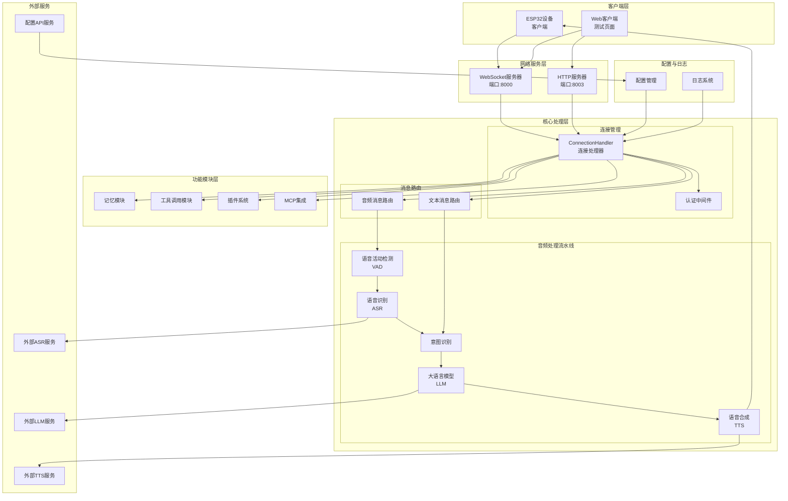
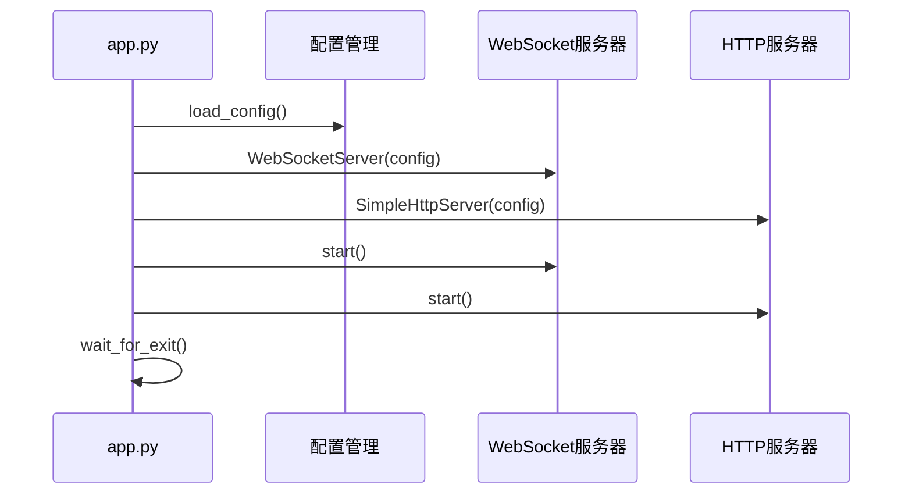
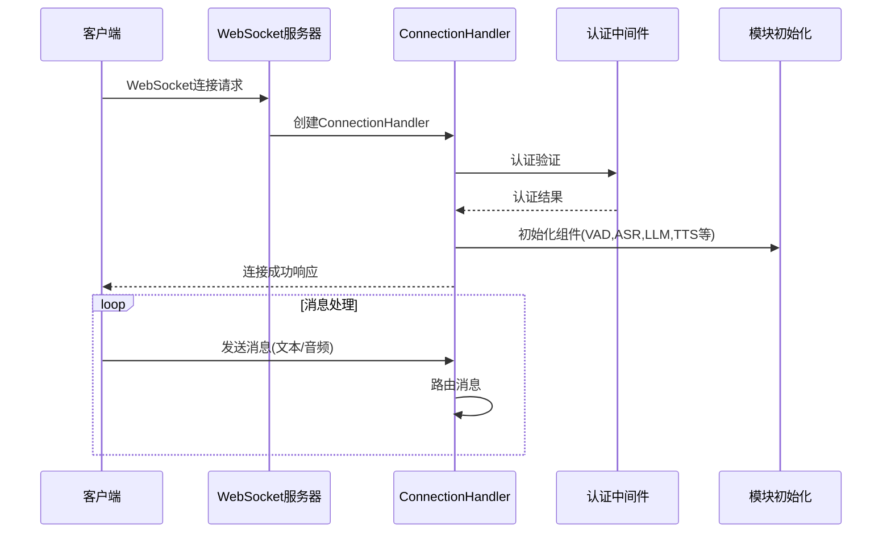
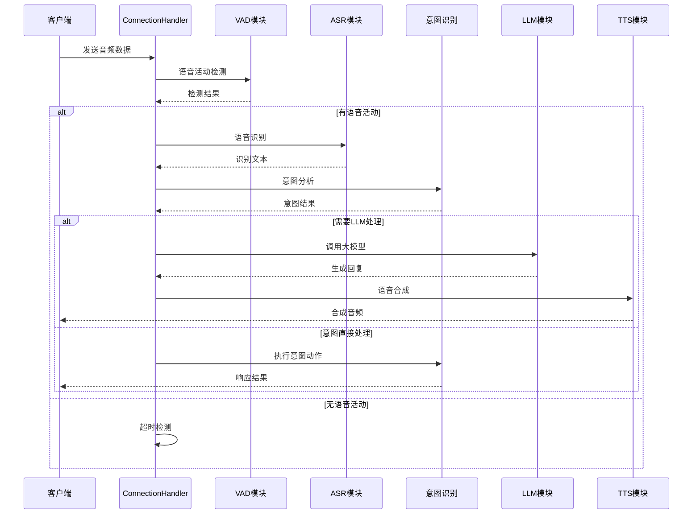
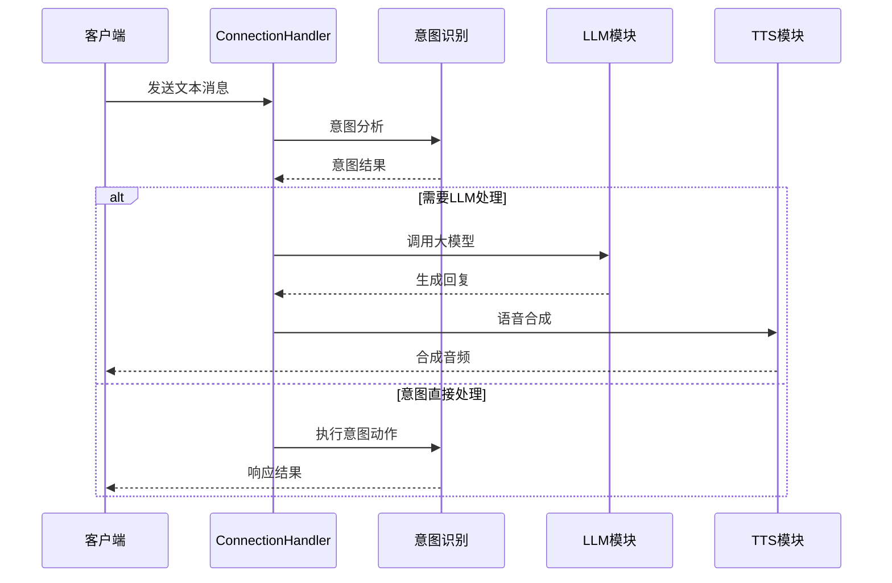

# 小智ESP32语音聊天服务器架构图

## 整体架构概览

## 详细组件调用流程

### 1. 启动流程

### 2. 连接处理流程

### 3. 音频处理流程

### 4. 文本处理流程

## 核心模块说明

### 1. 主程序 (app.py)
- **功能**: 服务器入口点，启动WebSocket和HTTP服务
- **关键组件**:
  - WebSocketServer: 处理语音聊天连接
  - SimpleHttpServer: 提供OTA和视觉分析接口
  - 配置加载和初始化

### 2. WebSocket服务器 (websocket_server.py)
- **功能**: 管理WebSocket连接，处理客户端连接请求
- **关键特性**:
  - 支持多客户端并发连接
  - 动态配置更新
  - 连接生命周期管理

### 3. 连接处理器 (connection.py)
- **功能**: 处理单个客户端的完整会话生命周期
- **核心组件**:
  - 认证中间件
  - 模块初始化(VAD, ASR, LLM, TTS, Memory, Intent)
  - 消息路由
  - 资源管理

### 4. 音频处理模块
- **VAD (Voice Activity Detection)**: 语音活动检测，识别用户是否在说话
- **ASR (Automatic Speech Recognition)**: 语音转文本，支持多种服务提供商
- **TTS (Text-to-Speech)**: 文本转语音，支持多种服务提供商

### 5. 智能处理模块
- **LLM (Large Language Model)**: 大语言模型，生成智能回复
- **Intent Recognition**: 意图识别，理解用户意图
- **Memory**: 对话记忆管理
- **Tools**: 工具调用系统

### 6. 插件系统
- **位置**: `plugins_func/functions/`
- **功能**: 扩展功能模块，如天气查询、音乐播放等
- **机制**: 自动导入和注册

### 7. 配置管理
- **配置文件**: `config.yaml`
- **功能**: 模块选择、API密钥管理、参数配置
- **特性**: 支持动态配置更新

## 数据流总结

1. **输入流**: 客户端音频/文本 → WebSocket → ConnectionHandler → 路由处理
2. **音频处理流**: VAD检测 → ASR识别 → 意图分析 → LLM处理 → TTS合成
3. **文本处理流**: 意图分析 → LLM处理 → TTS合成
4. **输出流**: TTS音频 → WebSocket → 客户端播放

这个架构设计支持高度模块化，每个组件都可以独立配置和替换，支持多种外部服务集成，具有良好的扩展性和维护性。